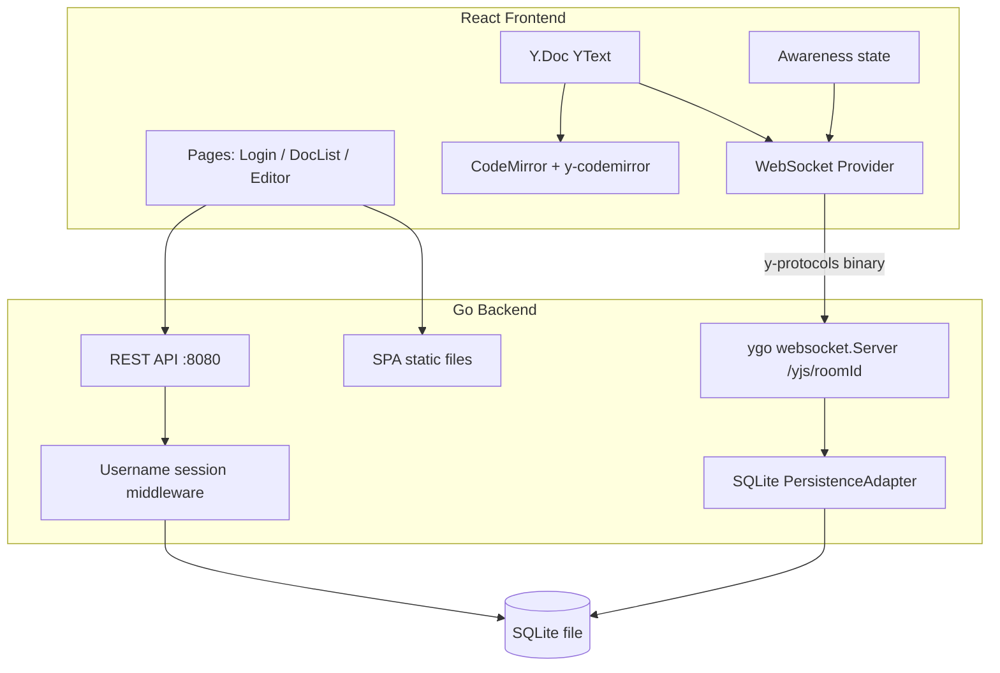

# Collab Editor

Real-time collaborative text editor built with **Go ([ygo](https://github.com/reearth/ygo))** on the backend and **React + Yjs + CodeMirror 6** on the frontend.

## Architecture



**Two channels, one process:**

- **REST** — username login, list/create/open documents
- **WebSocket** — CRDT sync + awareness at `/yjs/{documentId}`

Room ID = document UUID. The server holds an in-memory CRDT doc per room, restored from SQLite on first connect.

### Sync flow (interview talking points)

1. Client connects → SyncStep1/2 exchange state vectors until both sides converge
2. Edits are Yjs updates: server `ApplyUpdate` + `StoreUpdate` to SQLite, then forwards to peers
3. Conflict resolution is CRDT/YATA (no locks); the server is source of truth for **persistence**, not merge logic
4. Awareness (cursors, names) is ephemeral and not stored

## Repository layout

```
collab-editor/
├── backend/                 Go HTTP + ygo WebSocket + SQLite
├── frontend/                Vite + React + TypeScript SPA
├── scripts/                 Deploy smoke test
├── Dockerfile               Production single-container image
├── docker-compose.yml       Local hot-reload (backend + Vite)
├── docker-compose.prod.yml  Local production-style run
├── fly.toml                 Fly.io config + volume mount
└── railway.toml             Railway Dockerfile + health check
```

## Prerequisites

- [Docker](https://www.docker.com/) (recommended)
- Or locally: Go 1.25+, Node.js 22+

## Quick start (local development)

```bash
docker compose up --build
```

- Frontend (Vite): http://localhost:5173
- Backend health: http://localhost:8080/health
- Vite proxies `/api` and `/yjs` to the Go server

Without Docker:

```bash
# terminal 1
cd backend && go run ./cmd/server

# terminal 2
cd frontend && npm install && npm run dev
```

## Production image (single container)

The root `Dockerfile` builds the SPA, builds the Go binary, and serves both from one process on `:8080`. SQLite lives on a volume at `/data`.

```bash
docker compose -f docker-compose.prod.yml up --build
# → http://localhost:8080
```

Or:

```bash
docker build -t collab-editor .
docker run --rm -p 8080:8080 \
  -e SESSION_SECRET="$(openssl rand -hex 32)" \
  -e COOKIE_SECURE=false \
  -v collab_data:/data \
  collab-editor
```

## Environment variables

| Variable | Default | Description |
|----------|---------|-------------|
| `PORT` | `8080` | Listen port |
| `DATABASE_PATH` | `collab.db` | SQLite file path (`/data/collab.db` in containers) |
| `STATIC_DIR` | _(empty)_ | If set, serve built SPA from this directory (SPA fallback) |
| `SESSION_SECRET` | ephemeral random | Cookie signing key (set in prod or sessions reset on restart) |
| `COOKIE_SECURE` | `false` | Set `true` behind HTTPS |
| `ALLOWED_ORIGINS` | Vite origin in API-only mode; same-origin when `STATIC_DIR` is set | Comma-separated WS origins, or empty string for same-origin |
| `SHUTDOWN_TIMEOUT` | `10s` | Graceful drain timeout |
| `VITE_DEV_PROXY_TARGET` | `http://localhost:8080` | Vite proxy target (dev only) |

## Deploy

### Fly.io

1. Install the [Fly CLI](https://fly.io/docs/hands-on/install-flyctl/) and log in.
2. Adjust `app` / `primary_region` in [`fly.toml`](fly.toml) if needed.
3. Create a persistent volume and secrets:

```bash
fly volumes create collab_data --size 1 --region iad
fly secrets set SESSION_SECRET="$(openssl rand -hex 32)" COOKIE_SECURE=true
fly deploy
```

The app mounts `collab_data` at `/data` with `DATABASE_PATH=/data/collab.db`. TLS terminates at the Fly edge; leave `ALLOWED_ORIGINS` unset so ygo uses same-origin checks for WebSocket upgrades.

### Railway

1. Create a project from this repo. Railway will use [`railway.toml`](railway.toml) / the root `Dockerfile`.
2. **Attach a volume** mounted at `/data` (Project → service → Settings → Volumes).
3. Set variables:

| Variable | Value |
|----------|--------|
| `DATABASE_PATH` | `/data/collab.db` |
| `STATIC_DIR` | `/app/static` |
| `SESSION_SECRET` | random 32+ byte string |
| `COOKIE_SECURE` | `true` |
| `PORT` | `8080` (or Railway-assigned) |

4. Deploy. Health check: `GET /health`.

Without a volume, document edits are lost when the container is replaced.

## Smoke test (deploy / persistence)

Verifies SPA serving, two-client Yjs sync over authenticated WebSockets, and restore after restart:

```bash
cd scripts
npm ci
node deploy-smoke-test.mjs --full    # Docker image + volume restart
node deploy-smoke-test.mjs --local   # Go binary + process restart (no Docker)
```

## REST API (MVP)

| Method | Path | Behavior |
|--------|------|----------|
| `POST` | `/api/session` | `{ "username": "alice" }` → upsert user, HttpOnly session cookie |
| `GET` | `/api/me` | current user |
| `GET` | `/api/documents` | list owned documents |
| `POST` | `/api/documents` | `{ "title": "..." }` → create document |
| `GET` | `/api/documents/:id` | document metadata |
| `GET` | `/health` | liveness |
| WS | `/yjs/{room}` | Yjs sync + awareness (session required; room = document id) |
